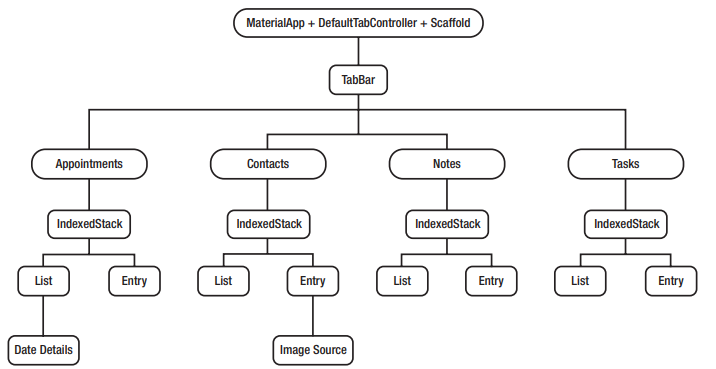

# flutter_book

## Work breakdown structure

### Dependencies
        dependencies:
        flutter:
        sdk: flutter
        scoped_model: 1.0.1
        sqflite: 1.1.2
        path_provider: 0.5.0+1
        flutter_slidable: 0.4.9
        intl: 0.15.7
        image_picker: 0.4.12+1
        flutter_calendar_carousel: 1.3.15+3
        cupertino_icons: ^0.1.2
## Getting Started

This project is a starting point for a Flutter application.

A few resources to get you started if this is your first Flutter project:

- [Lab: Write your first Flutter app](https://flutter.dev/docs/get-started/codelab)
- [Cookbook: Useful Flutter samples](https://flutter.dev/docs/cookbook)

For help getting started with Flutter, view our
[online documentation](https://flutter.dev/docs), which offers tutorials,
samples, guidance on mobile development, and a full API reference.
